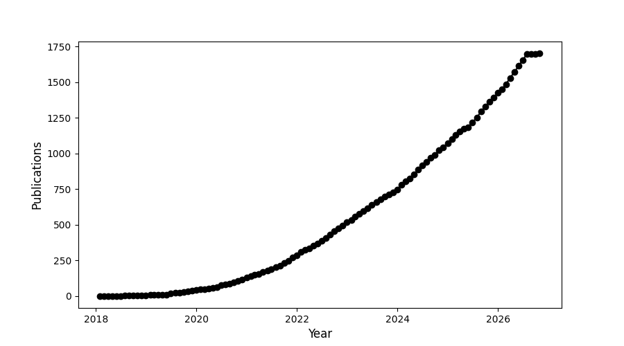

<h1>Lightkurve statistics</h1>
  
  
  
|    | Date       | Title                                                                                                                                                                                 | Author        |
|---:|:-----------|:--------------------------------------------------------------------------------------------------------------------------------------------------------------------------------------|:--------------|
|  0 | 2026-11-01 | [TIC 197757000: An Eclipsing Binary System Containing a δ Scuti-type Pulsating Star with Tidal Synchronization](https://ui.adsabs.harvard.edu/abs/2026RAA....26k5001Y/abstract)       | Yaqup, S      |
|  1 | 2026-10-01 | [HD3191, the high-mass X-ray binary that wasn't there](https://ui.adsabs.harvard.edu/abs/2026NewA..12702582R/abstract)                                                                | Rauw, G       |
|  2 | 2026-08-01 | [TESS Planets in Known Radial-velocity Cold Jupiter Systems: Hot Super-Earth Occurrence is Enhanced by Cold Jupiters](https://ui.adsabs.harvard.edu/abs/2026AJ....172...72L/abstract) | Liu, Q        |
|  3 | 2026-08-01 | [Orbit Refinement of WASP-18 b and Evidence Against the Existence of WASP-18 c](https://ui.adsabs.harvard.edu/abs/2026AJ....172...77N/abstract)                                       | Nediyedath, A |
| 36 | 2026-07-01 | [Pushing the Limit of Asteroseismic Detection for Cool Dwarfs Using TESS and Deep Learning](https://ui.adsabs.harvard.edu/abs/2026ApJ..1005..128K/abstract)                           | Karim, W      |
